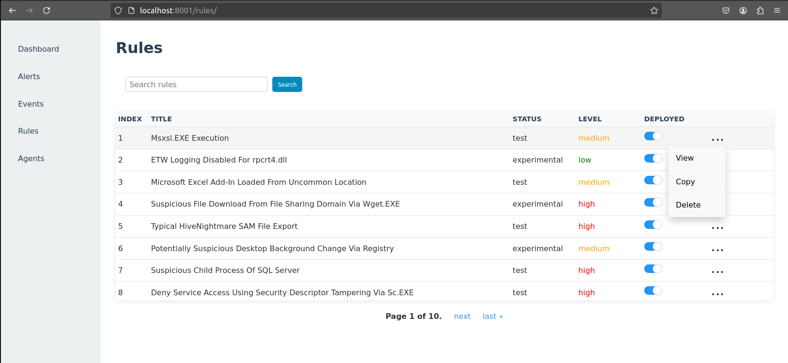
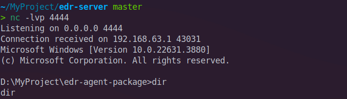
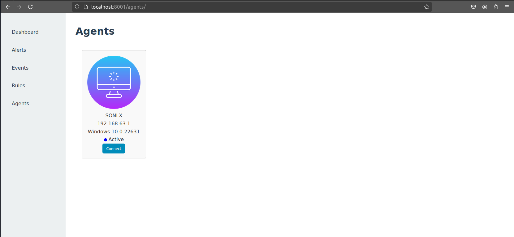
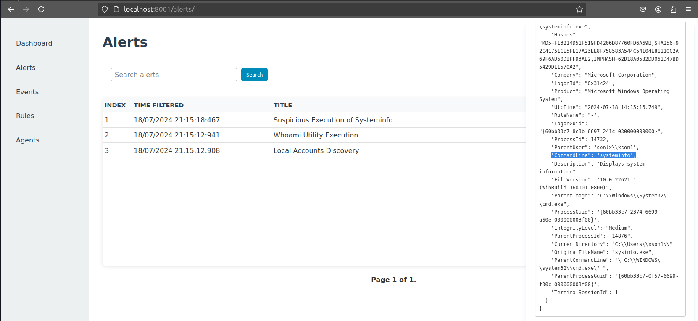
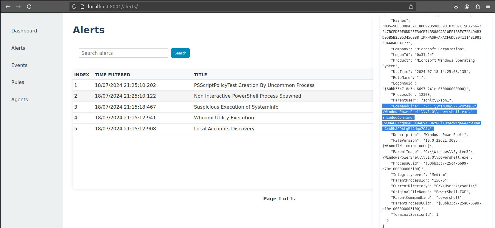

# EDR Server


EDR Server is a comprehensive (simple for now) Endpoint Detection and Response (EDR) system designed to monitor, detect, and respond to threats on network endpoints. It aims to provide real-time security against malware and other cyber threats by continuously monitoring endpoint activities and identifying suspicious behaviors.

## Features

- **Real-time Monitoring:** Continuous observation of endpoint activities to identify suspicious behaviors.
- **Threat Detection:** Advanced algorithms to detect known and unknown threats.
- **Automated Response:** Immediate action on detected threats to mitigate damage. (not implemented)
- **Incident Reporting:** Detailed reports on security incidents for analysis and compliance. (not implemented)
- **Customizable Policies:** Tailor security policies to meet specific organizational needs.

## Installation

1. Clone the repository:

```bash
git clone https://github.com/scrymastic/edr-server.git
```

2. Build the Docker compose file:

```bash
docker-compose build
```

3. Run the Docker compose file:

```bash
docker-compose up
```

4. Access the EDR Server at `http://localhost:8001`. Default credentials are `kali:kali`.

## Usage

### Dashboard

After logging in with the default credentials, navigate to the `Dashboard` to get an overview of the system's status, including the distribution of alerts and events.

### Alerts View

The `Alerts` tab shows all real-time alerts generated by the system, enabling quick identification and response to potential threats.

### Events View

The `Events` tab displays a timeline of all security events detected by the system, allowing for easy tracking and investigation of potential threats.

`Read events` button will enable you to read the events from the event log file (extension: .evtx).

Search for specific events using the search bar.

Supported operators are `=`, `~` (contains), `>`, `<`. All queries are case-insensitive.

Simple logical operators `AND`, `OR` (not nested) are also supported.

For example, to search for events with the event ID `13`, use the query `event_id="13"`. To search for events with the username `kali`, use the query `username~"kali"`. To search for time range, use the query `time_created__SystemTime<"2024-07-17T12:00:00.0000000Z"`.

### Rules Engine

Under the `Rules` tab, users can create and manage detection rules based on specific criteria, enhancing the system's ability to identify threats.

There are 1814 rules available in the system, imported from [Sigma rules for Windows](https://github.com/SigmaHQ/sigma/tree/master/rules/windows)



### Agents View

The `Agents` tab provides a detailed view of all endpoints monitored by the system, including their current status and recent activities.

The system offers the capability to establish a connection with the agent via a reverse shell. However, this functionality has raised security concerns.

To start a connection from the server, initiate a listening service by executing the command below. Ensure you replace `4444` with your preferred port number, which should match the one specified in the edr-agent's configuration file:

```bash
nc -lvp 4444
```
Subsequently, establish a connection to the agent by selecting the `Connect` button.



## Testing

Perform attacks on the endpoint to test the EDR system.

> **Note:** Install [edr-agent](https://github.com/scrymastic/edr-agent) to enable endpoint monitoring.

After completing the installation, connect the agent to the EDR server by running the following command:

```bash
edr-agent.exe
```



### Reconnaissance

Gain information about the system using the following commands:

```bash
whoami
systeminfo
```
After running the commands, the EDR system will generate alerts for the following events:



### Weaponization

### Delivery

### Exploitation

Start a process, notepad.exe in this case, using powershell base64 encoded command:

```bash
powershell.exe -EncodedCommand UwB0AGEAcgB0AC0AUAByAG8AYwBlAHMAcwAgAG4AbwB0AGUAcABhAGQALgBlAHgAZQA=
```


### Installation

### Command and Control (C2)

### Actions on Objectives

## Contributing

Contributions are welcome! Feel free to open issues and pull requests to help improve the project.

## License

This project is licensed under the MIT License. See the [LICENSE](LICENSE) file for details.

